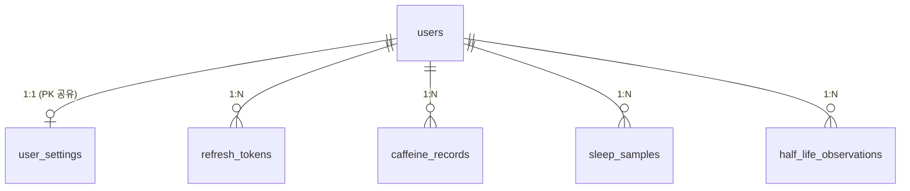

# DB 스키마

카페인 트래커 서버의 MySQL 8 테이블 스키마. (2026-09-06)

DDL 원본은 [`db-schema.sql`](db-schema.sql) 하나이며, **애플리케이션은 스키마를 만들거나 바꾸지 않는다.**
사용자가 DB에 직접 실행하고, 서버는 기동 시 엔티티와 대조만 한다(`ddl-auto: validate`).
테스트는 같은 파일을 H2(MySQL 호환 모드)에 적용해 엔티티와의 일치를 검증하므로, 엔티티와 DDL이 어긋나면 빌드가 실패한다.

## 적용 방법

데이터베이스·계정 생성은 README "로컬 실행 방법" 참조. 그 다음 프로젝트 루트에서 실행한다.

```bash
mysql -u caffeine -p caffeine_tracker < docs/db-schema.sql
```

- 모든 문장이 `CREATE TABLE IF NOT EXISTS`라 여러 번 실행해도 안전하다 (이미 있는 테이블은 건너뜀).
- 스키마가 없거나 엔티티와 다르면 서버가 기동 시 `Schema-validation` 오류로 즉시 실패한다.
- 운영 DB(RDS)도 동일하다. 새 이미지를 배포하기 전에 이 파일 또는 아래 변경 이력의 `ALTER`를 먼저 적용한다.

## 공통 규칙

- 엔진·문자셋: `InnoDB`, `utf8mb4` / `utf8mb4_unicode_ci`
- 시각 컬럼은 `DATETIME(6)`. 도메인 시각(`timestamp`·`start_at`·`end_at`)은 UTC 절대시각(`Instant`)으로 저장하고,
  감사·토큰 시각(`created_at`·`updated_at`·`expires_at`·`revoked_at`)은 서버 JVM 시각(`LocalDateTime`)이다.
- `DATE` 컬럼(`last_learned_date`·`obs_date`)은 요청 `tz` 기준 로컬 날짜.
- 모든 테이블에 `created_at` / `updated_at` — JPA Auditing(`BaseTimeEntity`)이 채운다.
- 사용자 종속 테이블은 `users(id)`를 참조하며 `ON DELETE CASCADE`.
- 컬럼별 의미와 기본값은 `db-schema.sql`의 주석 참조.

## 테이블 목록

| 테이블 | 도메인 | 설명 |
|---|---|---|
| `users` | user · auth | 계정 |
| `refresh_tokens` | auth | 리프레시 토큰 (SHA-256 해시만 저장) |
| `user_settings` | settings | 유저 설정 + 베이지안 학습 상태 (`users`와 1:1, PK 공유) |
| `caffeine_records` | caffeine | 카페인 섭취 기록 |
| `sleep_samples` | sleep | HealthKit 원시 수면 샘플 |
| `half_life_observations` | learning | 반감기 학습 관측 이력 (유저·날짜당 1건) |

## 관계



## 스키마 변경 절차

1. 엔티티 수정
2. `db-schema.sql`의 `CREATE TABLE` 갱신 — 테스트가 이 파일로 검증하므로 빠뜨리면 빌드 실패
3. 이미 만들어진 DB용 `ALTER` 문을 아래 변경 이력에 날짜와 함께 기록
4. 배포 전에 로컬 DB와 운영 DB에 그 `ALTER`를 직접 적용 — 빠뜨리면 기동 시 `Schema-validation` 오류

## 변경 이력

| 날짜 | 내용 | 기존 DB에 적용할 SQL |
|---|---|---|
| 2026-09-03 | 초기 스키마. 구 Flyway 마이그레이션 V1~V6를 통합했고 테이블 구조는 동일 | 없음. Flyway로 만든 DB는 그대로 사용 가능하며, 남아 있는 `flyway_schema_history`는 무해하다 (정리: `DROP TABLE flyway_schema_history;`) |
| 2026-09-06 | `user_settings`에 알림 종류별 on/off 컬럼 3개 추가 (`notify_cutoff`·`notify_bedtime_residual`·`notify_record_reminder`). 기존 행은 전부 1(켜짐) | `ALTER TABLE user_settings ADD COLUMN notify_cutoff BIT(1) NOT NULL DEFAULT 1 AFTER is_learning_enabled, ADD COLUMN notify_bedtime_residual BIT(1) NOT NULL DEFAULT 1 AFTER notify_cutoff, ADD COLUMN notify_record_reminder BIT(1) NOT NULL DEFAULT 1 AFTER notify_bedtime_residual;` 롤백: `ALTER TABLE user_settings DROP COLUMN notify_cutoff, DROP COLUMN notify_bedtime_residual, DROP COLUMN notify_record_reminder;` |
